 
## 查看主页获取源码

### 一、作品包含

源码+数据库+设计文档万字+PPT+全套环境和工具资源+部署教程

### 二、项目技术

前端技术：Html、Css、Js、Vue、Element-ui

数据库：MySQL

后端技术：Java、Spring Boot、MyBatis

  

### 三、运行环境

开发工具：IDEA/eclipse

数据库：MySQL5.7

数据库管理工具：Navicat10以上版本

环境配置软件： JDK1.8+Maven3.6.3

前端Nodejs：14

### 四、项目介绍
项目编号：springbootA181

工厂生产设备维护管理系统是为了解决制造业中设备维护效率低下、故障频发和维修成本高等问题而设计的。在现代化生产中，设备是生产力的核心，良好的设备维护管理能够确保生产线的稳定运行，减少停机时间，延长设备寿命，从而提高企业的生产效益和竞争力。

系统分为管理员、维修人员、员工
管理员的功能：系统首页、个人中心、员工管理、维修人员管理、维修排班管理、设备信息管理、故障报修管理、设备档案管理、维修工单管理、维修任务管理、维修记录管理、维修公告管理、运行记录管理以及养护计划管理。
维修人员的功能：系统首页、个人中心、维修排班管理、设备档案管理、维修记录管理、维修公告管理和养护计划管理。
员工的功能：系统首页、个人中心、设备信息管理、故障报修管理、维修公告管理、运行记录管理。

### 五、运行截图

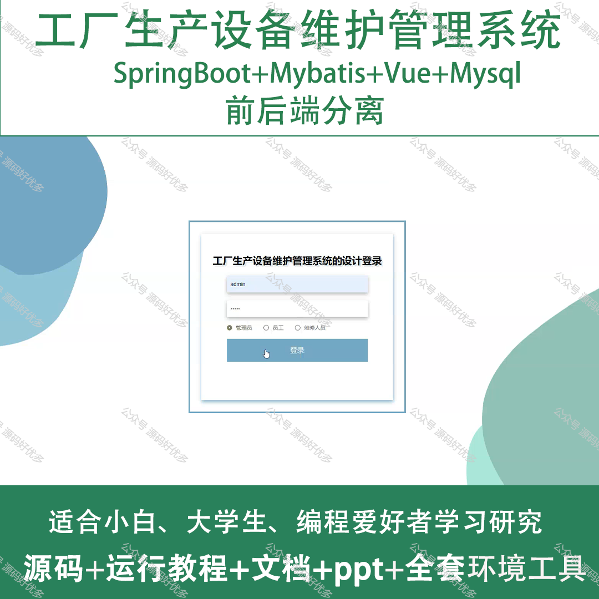
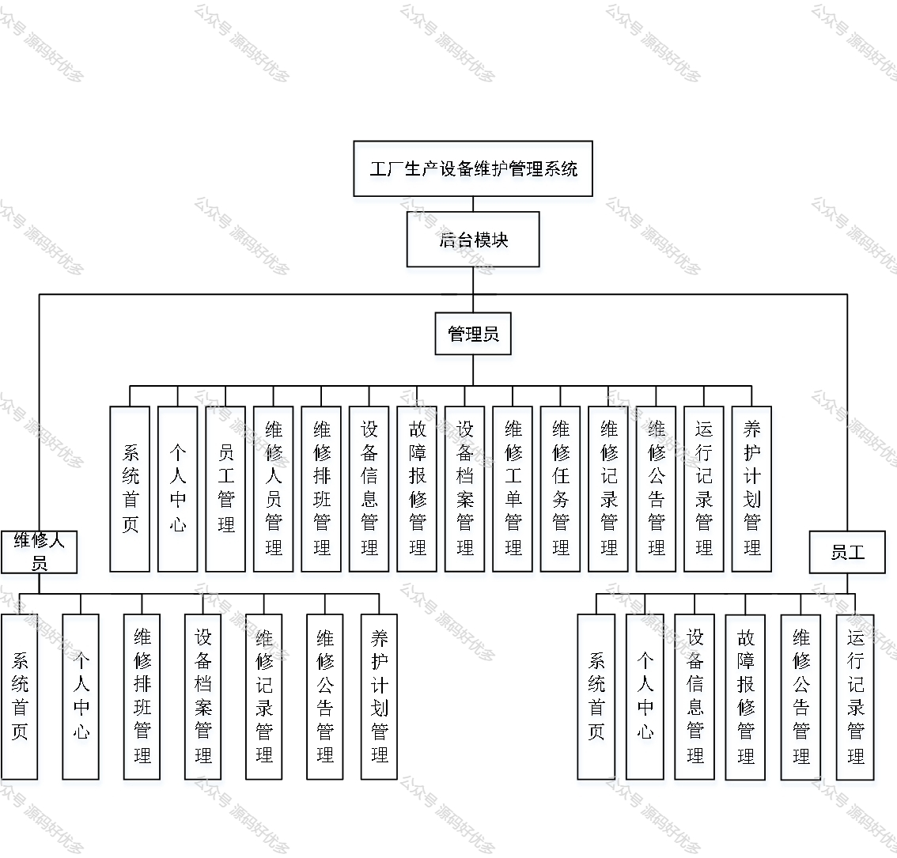
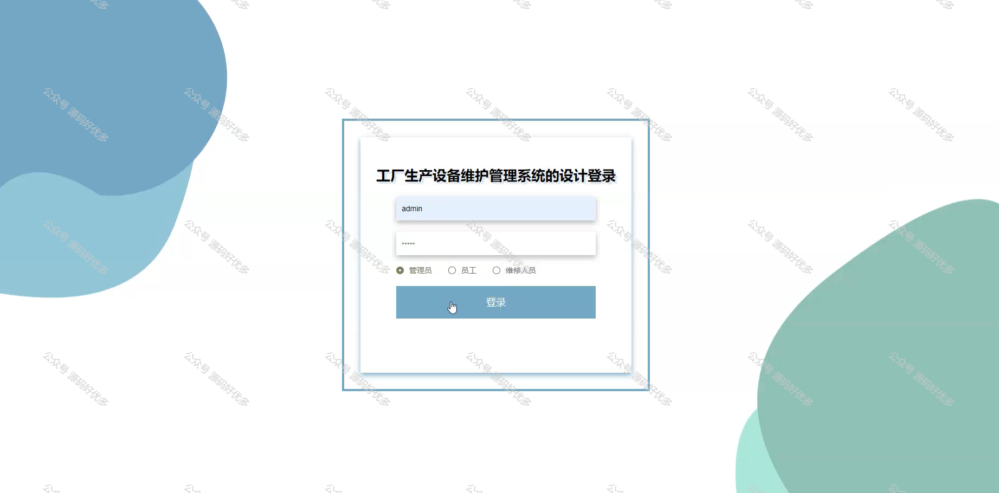
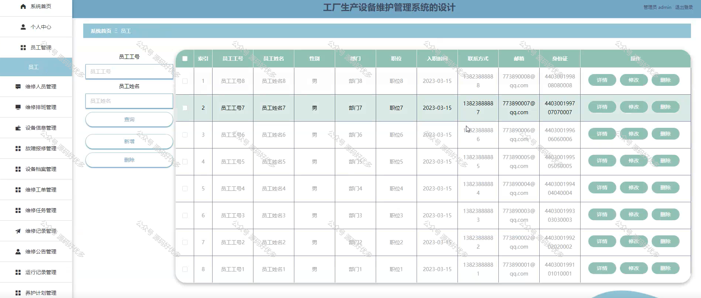
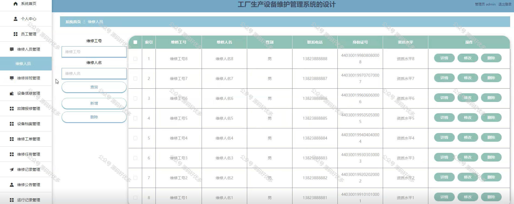
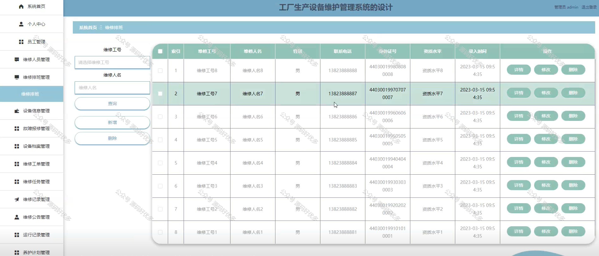
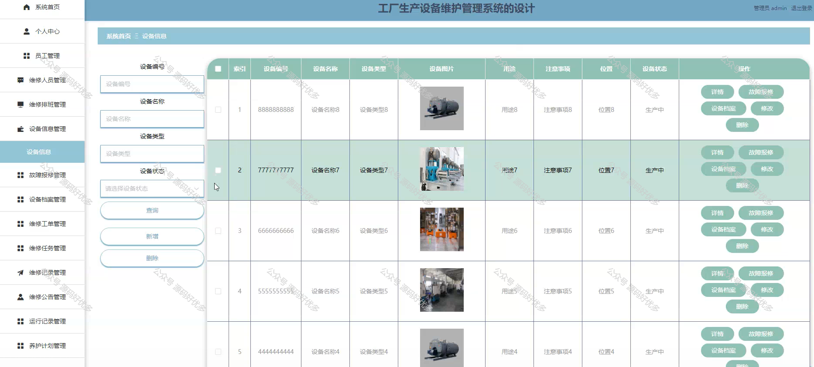
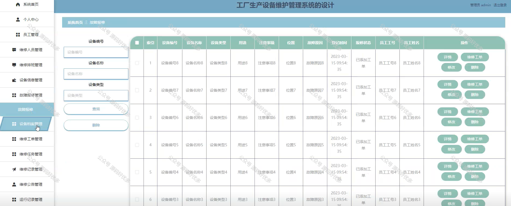
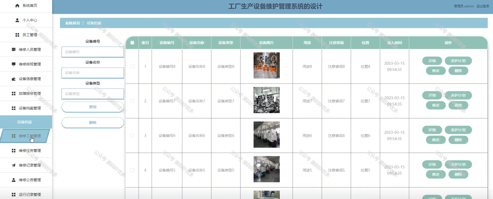
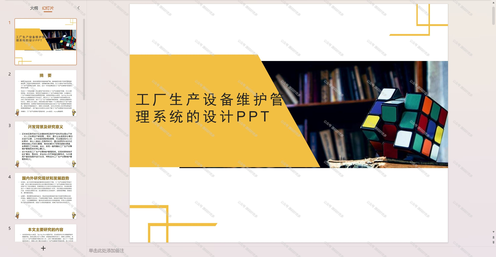
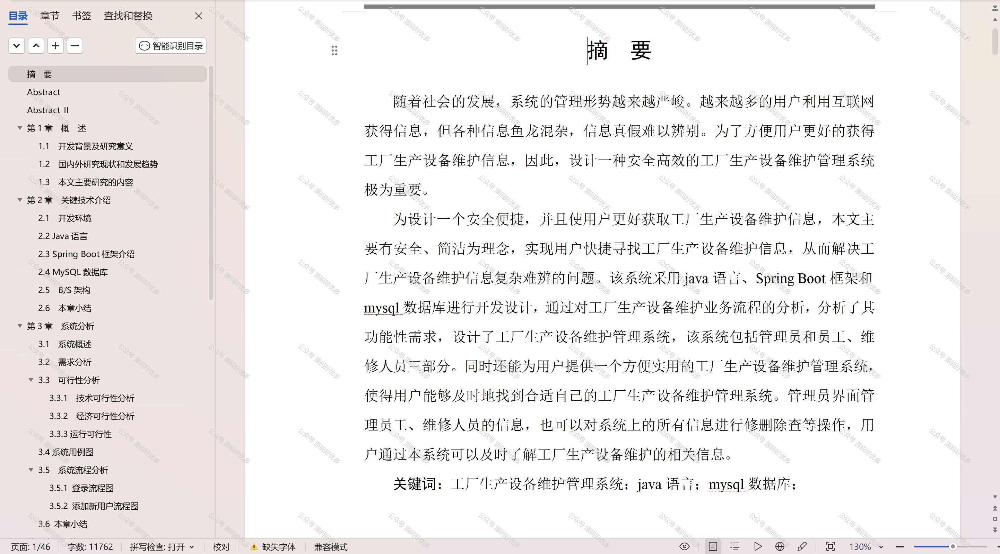

  
